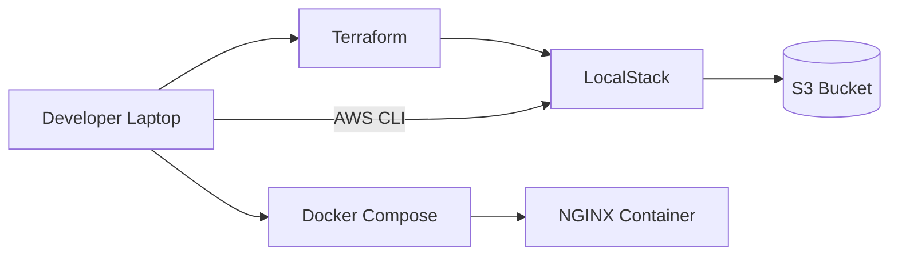

# Local Cloud IaC Demo (Terraform + LocalStack + S3 + NGINX)

This project demonstrates how to simulate AWS infrastructure locally using **Terraform**, **LocalStack**, **Docker Compose**, and the **AWS CLI**.

It provisions an S3 bucket using Infrastructure as Code (IaC) and allows uploading log files into the bucket while running an NGINX service locally.

This is useful for learning DevOps practices without spending real AWS money.

---

## 🏗 Architecture


Technologies Used:
* Terraform
* LocalStack
* AWS CLI
* Docker & Docker Compose
* NGINX
```
```
Project Features:
* Provision S3 bucket using Terraform
* Simulate AWS locally with LocalStack
* Upload logs using AWS CLI
* Run NGINX locally with Docker Compose
* Output useful Terraform values

Prerequisites:
Install the following:
* Docker
* Docker Compose
* Terraform
* AWS CLI


How to Run the Project
1️⃣ Start LocalStack and NGINX
```
docker-compose up -d
```

2️⃣ Initialize Terraform
```
terraform init
```

3️⃣ Apply Infrastructure
```
terraform apply
```

Confirm with:
```
yes
```

4️⃣ Verify S3 Bucket
```
aws --endpoint-url=http://localhost:4566 s3 ls
```

5️⃣ Upload Logs
```
echo "Log from Festus" > log.txt
aws --endpoint-url=http://localhost:4566 s3 cp log.txt s3://localstack-logs-bucket/
```

6️⃣ List Files
```
aws --endpoint-url=http://localhost:4566 s3 ls s3://localstack-logs-bucket
```

🌐 Access NGINX
Open your browser:
```
http://localhost:8080
```

🎯 DevOps Use Case
```
* This project simulates real-world DevOps workflows:
* Infrastructure as Code
* Local cloud testing
* Log storage
* Service deployment
* Automation readiness
* It prepares you for real AWS deployments safely and cheaply.
```
```
👨‍💻 Author

Festus Okagbare
DevOps / Cloud Engineer
Nigeria 🇳🇬
```